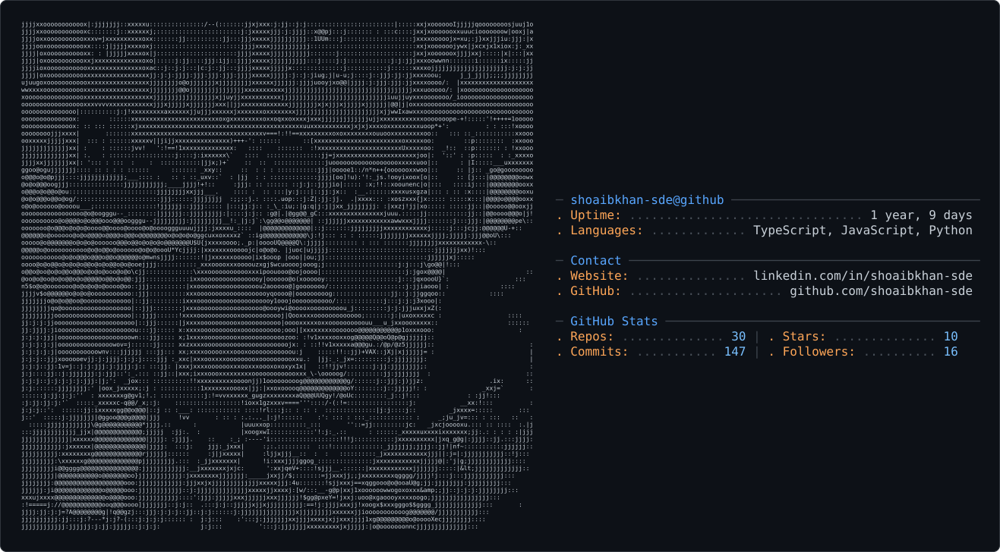

<picture>
  <source media="(prefers-color-scheme: dark)" srcset="light_mode.svg" />
  <source media="(prefers-color-scheme: light)" srcset="dark_mode.svg" />
  
</picture>

<!-- Animated Header -->


<!-- Typing Animation -->
<div align="center">
  
</div>

<br/>

<!-- Quick Badges -->
<div align="center">
  <a href="https://github.com/shoaibkhan-sde">
    
  </a>
  &nbsp;
  <a href="https://github.com/shoaibkhan-sde?tab=followers">
    
  </a>
  &nbsp;
  <a href="https://github.com/shoaibkhan-sde?tab=repositories">
    
  </a>
</div>

<br/>

## 🎯 About Me

```typescript
const shoaib = {
    pronouns: "He" | "Him",
    location: "India 🇮🇳",
    role: "SDE Aspirant | CSE Engineering Student",
    currentFocus: ["Data Structures & Algorithms", "Full-Stack (MERN)", "System Design Basics"],
    funFact: "The only thing I love more than solving a hard problem is the feeling right before the solution clicks 💡",

    languages: ["C++", "Java", "Python", "JavaScript"],
    technologies: {
        frontEnd: ["React", "HTML", "CSS", "Markdown"],
        backEnd: ["Node.js", "Express.js"],
        databases: ["MongoDB"],
        tools: ["Git", "GitHub"]
    },
    currentlyLearning: ["Advanced Git/GitHub workflows", "Database Optimization", "OOP Design Principles"],
    lookingForHelp: ["Mastering Git for large-scale projects", "SDE Internship Interview Prep"],
    askMeAbout: ["DSA", "MERN Stack", "Competitive Programming"],
    reachMe: "shoaib.cse.engineer@gmail.com"
};
```

<br/>

<div align="center">

<!-- Title -->


<br/>


<br/>

<!-- Snake Animation -->


<br/>


<br/>


</div>

<br/>

## 🌍 Connect with Me

<p align="center">
  <a href="https://www.linkedin.com/in/shoaibkhan-sde">
    
  </a>
  &nbsp;&nbsp;
  <a href="mailto:shoaib.cse.engineer@gmail.com">
    
  </a>
  &nbsp;&nbsp;
  <a href="https://github.com/shoaibkhan-sde">
    
  </a>
</p>

## 🛠️ Tech Arsenal

<table align="center" width="100%">
<tr>
<td width="50%" valign="top">

<h3 align="center">🎨 Frontend</h3>
<p align="center">
  
</p>

<br/>

<h3 align="center">🔮 Backend & Database</h3>
<p align="center">
  
</p>

</td>
<td width="50%" valign="top">

<h3 align="center">💻 Languages</h3>
<p align="center">
  
</p>

<br/>

<h3 align="center">🧰 Tools</h3>
<p align="center">
  
</p>

</td>
</tr>
</table>

## 📈 Contribution Graph


## 🎯 Current Focus

<table align="center" width="100%">
<tr>
<td width="50%" valign="top">

<h3 align="center">🚀 Learning Path</h3>

```yaml
Data Structures & Algorithms:
  - Problem Solving Patterns
  - Competitive Programming
  - Interview Preparation

Full-Stack (MERN):
  - React + Node.js + Express + MongoDB
  - REST API Design
  - Authentication & Authorization

Core CS:
  - Object-Oriented Design
  - Database Optimization
  - Git/GitHub Advanced Workflows
```

</td>
<td width="50%" valign="top">

<h3 align="center">💡 Goals</h3>

```yaml
Short Term:
  - Crack SDE Internships
  - Solve 300+ DSA Problems
  - Contribute to Open Source

Long Term:
  - Land a Strong SDE Role
  - Build Impactful Products
  - Mentor Fellow Students
```

</td>
</tr>
</table>

## 💬 Dev Quote

<p align="center">
  
</p>

## 🎯 Fun Facts About Me

✅ The only thing I love more than solving a hard problem is the feeling right before the solution clicks 💡  
✅ I can go from debugging a segfault in C++ to styling a React component in the same afternoon  
✅ Believer in **clean code**, **consistent commits**, and **learning in public**

---

## 💖 Show Some Love!

💖 **Drop a star** ⭐ on my repositories if you like my work!  
🤝 **Fork** and **contribute** to make them even better!  
📢 Let's connect and build something great together!

<div align="center">

**🌟 Made with ❤️ by [Shoaib Khan](https://github.com/shoaibkhan-sde) 🌟**

*"The only thing I love more than solving a hard problem is the feeling right before the solution clicks."*

</div>

---

[](https://visitcount.itsvg.in)

<div align="center">
  
</div>
