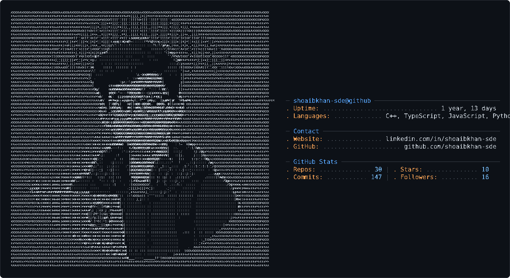
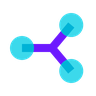
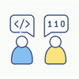
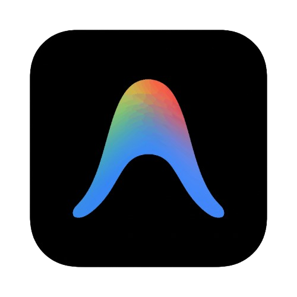
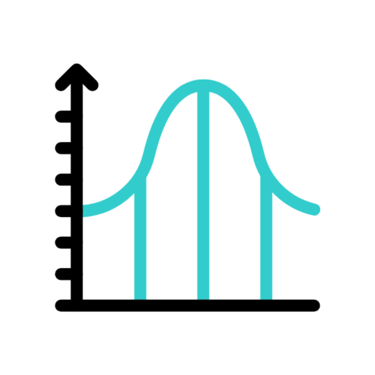
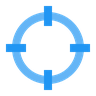
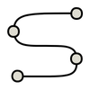

<picture>
  <source media="(prefers-color-scheme: dark)" srcset="light_mode.svg" />
  <source media="(prefers-color-scheme: light)" srcset="dark_mode.svg" />
  
</picture>

<!-- Animated Header -->


<!-- Typing Animation -->
<div align="center">
  
</div>

<br/>

<!-- Quick Badges -->
<div align="center">
  <a href="https://github.com/shoaibkhan-sde">
    
  </a>
  &nbsp;
  <a href="https://github.com/shoaibkhan-sde?tab=followers">
    
  </a>
  &nbsp;
  <a href="https://github.com/shoaibkhan-sde?tab=repositories">
    
  </a>
</div>

<br/>

<h2>
   About Me
</h2>

```typescript
const shoaib = {
    pronouns: "He" | "Him",
    location: "India 🇮🇳",
    education: "B.E. in Computer Science and Engineering (3rd Year)",
    college: "Padmashri Dr. V.B. Kolte College of Engineering",
    expectedGraduation: 2028,
    role: "SDE Aspirant | CSE Engineering Student",
    currentFocus: ["Data Structures & Algorithms", "Full-Stack (MERN)", "System Design Basics"],

    languages: ["C++", "Java", "Python", "JavaScript"],
    technologies: {
        frontEnd: ["React", "Next.js", "HTML", "CSS", "Markdown"],
        backEnd: ["Node.js", "Express.js"],
        databases: ["MongoDB"],
        tools: ["Git", "GitHub"]
    },
    currentlyLearning: ["core CS subjects","System Design Fundamentals"],
    lookingForHelp: ["Mastering Git for large-scale projects", "SDE Internship Interview Prep"],
    askMeAbout: ["DSA", "MERN Stack", "Competitive Programming"],
    reachMe: "shoaib.cse.engineer@gmail.com"
};
```

<br/>

<div align="center">

<!-- Title -->


<br/>


<br/>

<!-- Snake Animation -->


<br/>


<br/>


</div>

<br/>

<h2>
   Connect with Me
</h2>

<p align="center">
  <a href="https://www.linkedin.com/in/shoaibkhan-sde">
    
  </a>
  &nbsp;&nbsp;
  <a href="mailto:shoaib.cse.engineer@gmail.com">
    
  </a>
  &nbsp;&nbsp;
  <a href="https://github.com/shoaibkhan-sde">
    
  </a>
</p>

<h2>
   Tech Stack
</h2>

<p align="center">
  
</p>

<table align="center" width="100%">
  <tr>
    <td width="50%" valign="top" align="center">
      <h3 align="center"><br/>Frontend</h3>      
      
    </td>
    <td width="50%" valign="top" align="center">
      <h3 align="center"><br/>Languages</h3>
      
    </td>
  </tr>
  <tr>
    <td width="50%" valign="top" align="center">
      <h3 align="center"><br/>Backend &amp; Database</h3>
      
    </td>
    <td width="50%" valign="top" align="center">
      <h3 align="center"><br/>Tools</h3>      
      <br/>
      &nbsp;&nbsp;     
    </td>
  </tr>
</table>

<h2>
   GitHub Stats
</h2>

<p align="center">
  
</p>

<p align="center">
  
</p>


<h2>
   Current Focus
</h2>

<table align="center" width="100%">
<tr>
<td width="50%" valign="top">

<h2 align="center">
   Learning Path
</h2>

```yaml
Data Structures & Algorithms:
  - Problem Solving Patterns
  - Competitive Programming
  - Interview Preparation

Full-Stack (MERN):
  - React + Node.js + Express + MongoDB
  - REST API Design
  - Authentication & Authorization

Core CS:
  - Operating Systems
  - Database Management Systems
  - Computer Networks
  - Object-Oriented Programming & Design Principles
  - System Design Fundamentals
```

</td>
<td width="50%" valign="top">

<h2 align="center">
   Goals
</h2>

```yaml
Short Term:
  - Crack SDE Internships
  - Solve 300+ DSA Problems
  - Contribute to Open Source

Long Term:
  - Land a Strong SDE Role
  - Build Impactful Products
  - Mentor Fellow Students
```

</td>
</tr>
</table>

---

<h2>
   Show Some Love!
</h2>

<p>
   <b>Drop a star</b> on my repositories if you like my work!<br>
   <b>Fork</b> and <b>contribute</b> to make them even better!<br>
   Let's connect and build something great together!<br>
</p>

<p align="center">
  <b>Made with ❤️ by <a href="https://github.com/shoaibkhan-sde">Shoaib Khan</a></b>
  
</p>

<p align="center">
  <i>"The only thing I love more than solving a hard problem is the feeling right before the solution clicks."</i>
</p>

---

[](https://visitcount.itsvg.in)

<div align="center">
  
  <div align="center">
    
  </div>
</div>
